# WiFi Attack Simulator — Reporte de Ejecución

Fecha de ejecución: 07 de mayo de 2026

---

## Resumen Ejecutivo

Se completaron los **7 ejercicios** del simulador en su totalidad. Todas las preguntas de verificación de conocimiento fueron respondidas correctamente, alcanzando el rango máximo disponible.

---

## Pantalla Inicial

Al cargar el simulador se muestra el panel principal con el mapa de red en tiempo real, la barra lateral de vectores de ataque y el marcador en cero.

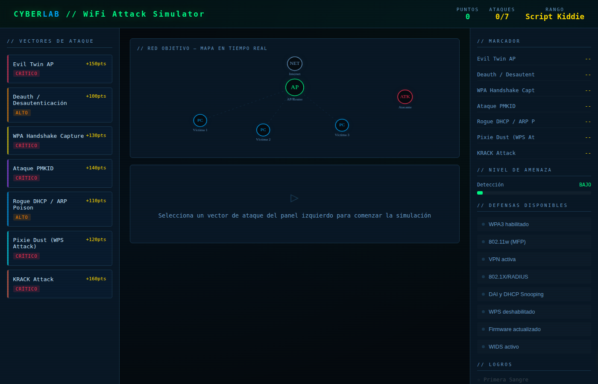

---

## Ejercicios Ejecutados

### 1 · Evil Twin AP — CRÍTICO (150 pts)

Crea un punto de acceso falso que imita una red legítima para interceptar tráfico. Pasos: reconocimiento → clonar AP → deauth → captura de tráfico.

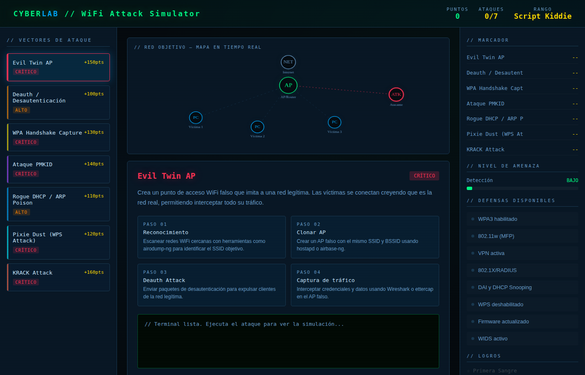
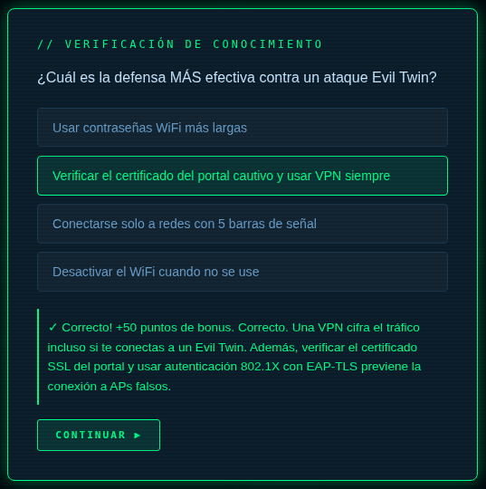

**Defensa clave:** VPN obligatoria + WPA3-Enterprise / 802.1X

---

### 2 · Deauth / Desautenticación — ALTO (100 pts)

Explota que los management frames 802.11 no están cifrados en WPA2, forzando la desconexión de clientes para capturar el handshake.

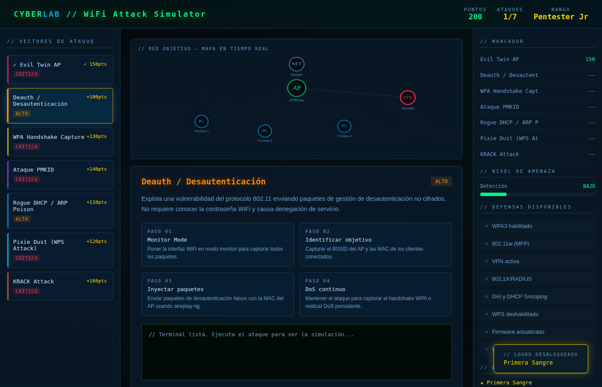
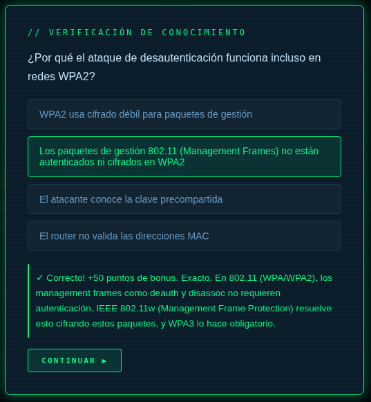

**Defensa clave:** 802.11w / Management Frame Protection (MFP) + WPA3

---

### 3 · WPA Handshake Capture — CRÍTICO (130 pts)

Captura el 4-way handshake WPA/WPA2 y lo somete a ataque de diccionario offline con herramientas como hashcat.

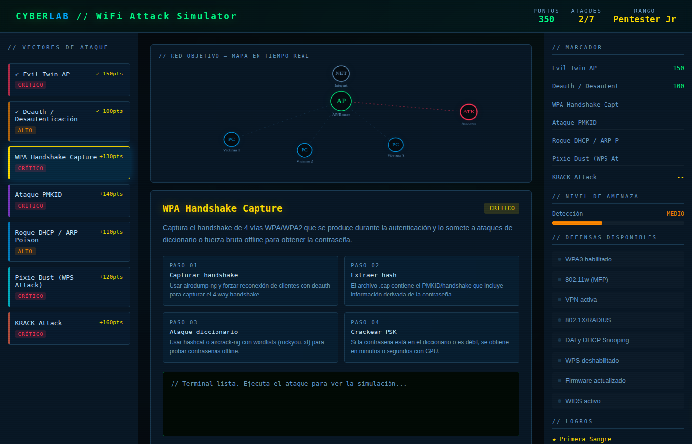
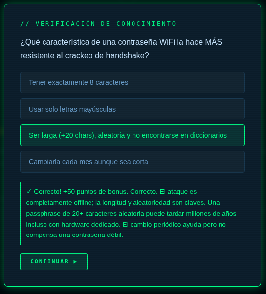

**Defensa clave:** Passphrase +20 caracteres aleatorios + WPA3-SAE

---

### 4 · Ataque PMKID — CRÍTICO (140 pts)

Técnica de 2018: obtiene el PMKID directamente del AP sin necesidad de clientes conectados, luego lo crackea offline.

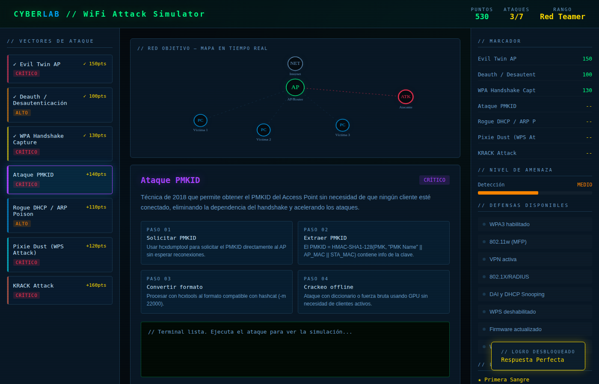
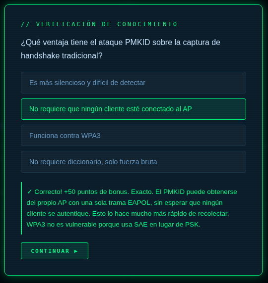

**Defensa clave:** WPA3-SAE + contraseñas largas y aleatorias

---

### 5 · Rogue DHCP / ARP Poison — ALTO (110 pts)

Una vez dentro de la red, agota el pool DHCP legítimo y levanta un servidor DHCP falso para redirigir todo el tráfico (MitM).

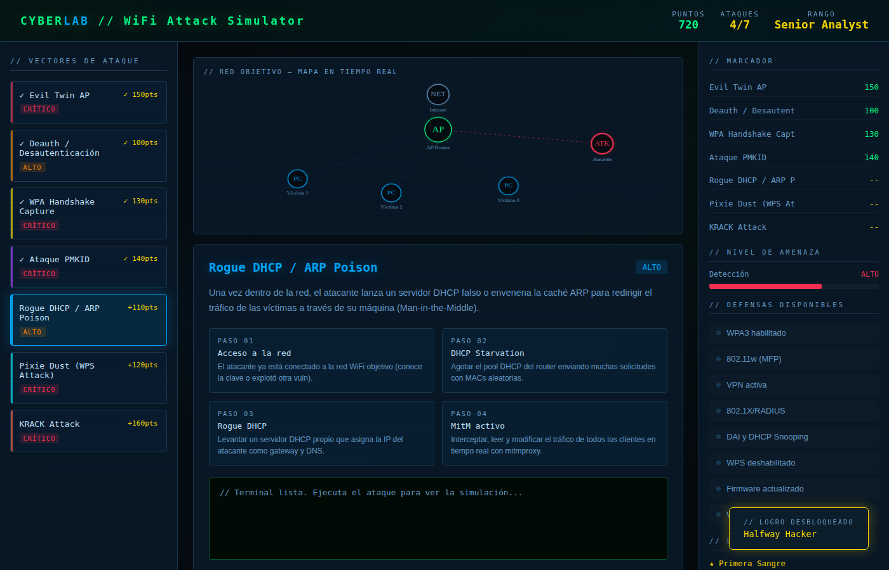
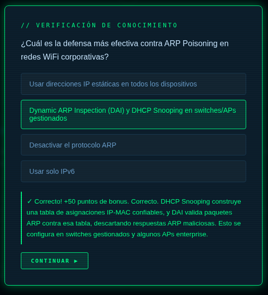

**Defensa clave:** Dynamic ARP Inspection (DAI) + DHCP Snooping + segmentación VLAN

---

### 6 · Pixie Dust (WPS Attack) — CRÍTICO (120 pts)

Explota la débil generación de números aleatorios en implementaciones WPS de routers domésticos para obtener el PIN en segundos.

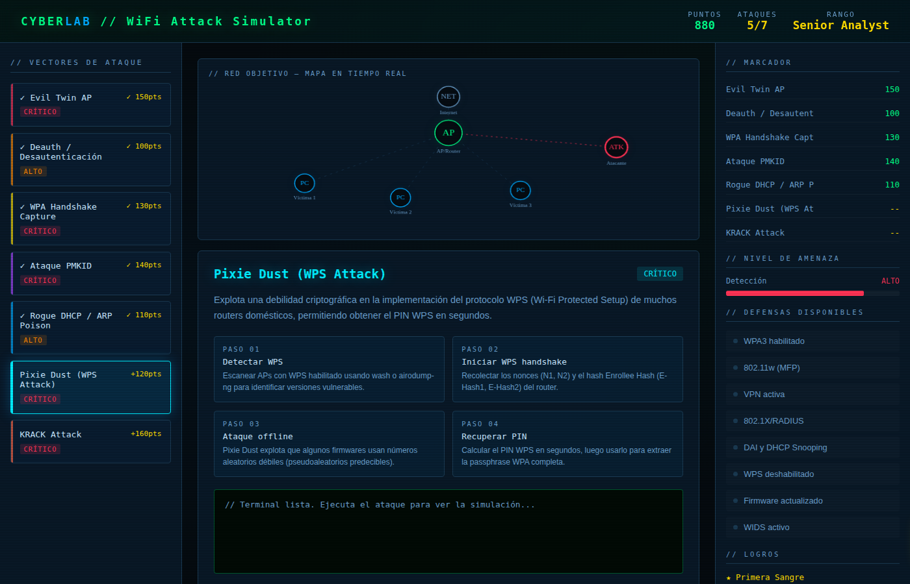
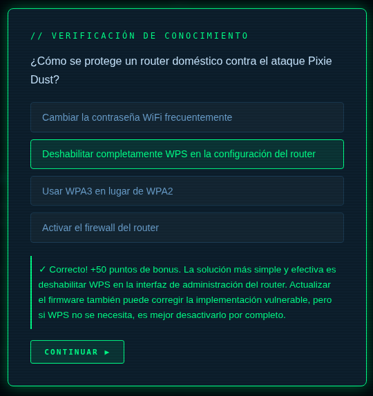

**Defensa clave:** Deshabilitar WPS completamente en el router

---

### 7 · KRACK Attack — CRÍTICO (160 pts)

Key Reinstallation Attack (CVE-2017-13077): fuerza la reinstalación de claves en el 4-way handshake WPA2, rompiendo el cifrado sin conocer la contraseña.

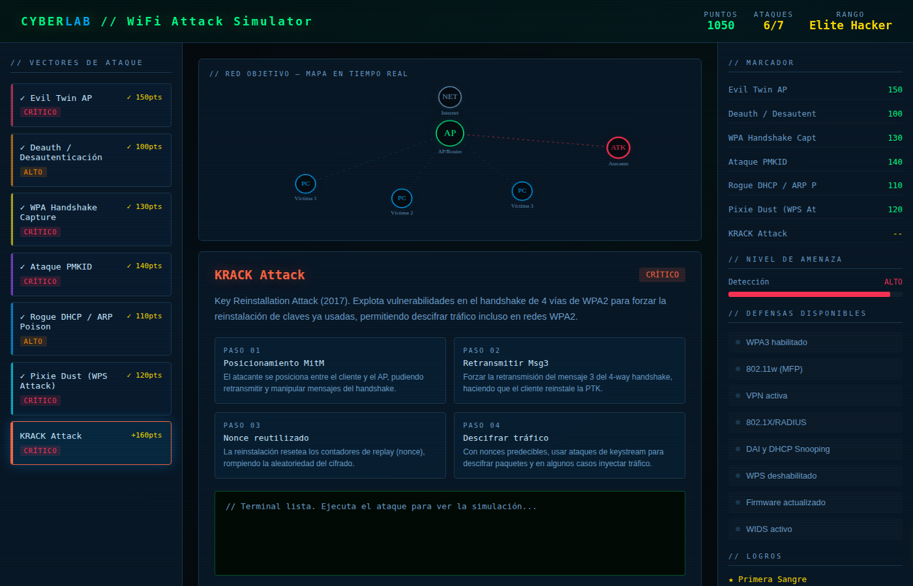
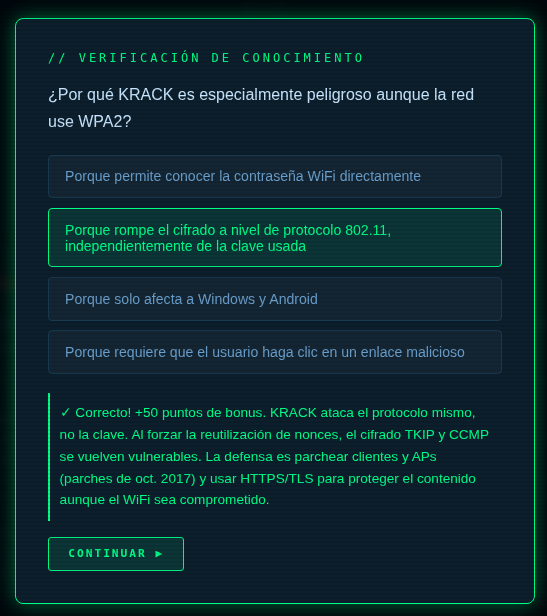

**Defensa clave:** Parches de seguridad oct. 2017 + WPA3 + HTTPS/TLS en todas las conexiones

---

## Marcador Final

Al completar todos los ataques y responder cada quiz correctamente, el simulador otorgó el rango máximo **Elite Hacker** con 1260 puntos y nivel de amenaza al 100%.

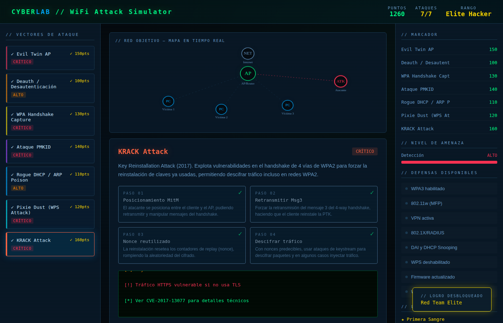

---

## Conclusiones

| Ataque          | Severidad | Pts base      | Quiz           | Total          |
| --------------- | --------- | ------------- | -------------- | -------------- |
| Evil Twin AP    | CRÍTICO  | 150           | +50            | 200            |
| Deauth          | ALTO      | 100           | +50            | 150            |
| WPA Handshake   | CRÍTICO  | 130           | +50            | 180            |
| PMKID           | CRÍTICO  | 140           | +50            | 190            |
| Rogue DHCP      | ALTO      | 110           | +50            | 160            |
| Pixie Dust      | CRÍTICO  | 120           | +50            | 170            |
| KRACK           | CRÍTICO  | 160           | +50            | 210            |
| **TOTAL** |           | **910** | **+350** | **1260** |

El simulador cubre los vectores de ataque WiFi más relevantes, desde ataques activos de suplantación hasta vulnerabilidades de protocolo. Las defensas más impactantes son: migrar a **WPA3**, habilitar **802.11w (MFP)**, usar **VPN**, deshabilitar **WPS** y mantener firmware actualizado.
